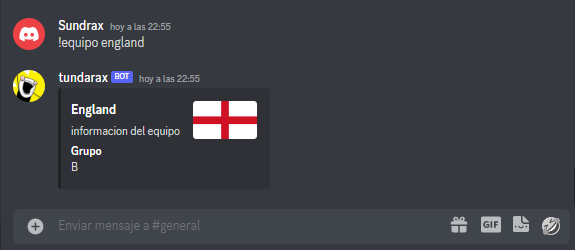

Requisitos: 
# Instalar python, versión 3.10.7
# Tener cuenta en Discord

# Pasos para utilizar el codigo correctamente.
1-Instalación de python: Vamos a nuestro navegador en google y colocamos python. 

1.1-Al hacer clic en downloads se muestra la siguiente pantalla:
 
Presionamos downloads nuevamente y seleccionamos Windows o MacOS, en este caso seleccionaremos Windows.
Buscamos la versión 3.10.7 de python ya que es la version que mejor funciona con este bot, y descargamos el instalador bien sea de 32bits o 64bits, como podemos ver en la siguiente imagen:

Una vez descargado procedemos a realizar la instalación 

Damos doble clic al instalador y nos muestra la siguiente pantalla, seleccionaremos la opción add python_3.10 to PATH para que nos permita movernos desde el terminal  Luego presionamos "Install Now".

Ya instalado el python presionamos "close" y procedemos a abrir nuestro Editor de código fuente, en este caso yo utilizo (Visual Studio Code) y procederemos a instalar las dependecias necesarias.

Abrimos el terminal de visual studio code haciendo clic en los iconos que se muestra en la siguiente imagen 

al abrir presionamos "TERMINAL" y escribimos en la parte inferior pip install json-server.py
 y presionamos enter. Al terminar su instalación procedemos a instalar las otras dependencias necesarias, colocamos los siguientes comandos: pip install python-dotenv, pip install extcolors, pip install requests, pip install, al instalar todas las dependencias podemos reiniciar nuestro visual studio code, para que tome las dependencias de manera correcta. 

# Pasos en la cuenta de Discord  

2- Al tener la cuenta de discord creada, iniciamos sesión. Debemos crear un nuevo servidor 
Luego presionamos "create my own" luego "for me and my friends" y le colocamos un nombre a ese servidor. . Una vez creado el servidor, debemos crear el Bot...

¿Como creamos el bot? Sencillo, vamos al navegador y colocamos "Discord developer" seleccionamos Applications  

 Una vez cargada la pagina presionamos applications nuevamente. Seleccionamos
 "new application"  y le colocamos un nombre, aceptamos los terminos y condiciones y presionamos "create" 

 luego presionamos en el menú la opción "Bot"  y presionamos "Add Bot" y luego "yes" ... 
 
 Una vez creado el bot bajamos a "Privileged Gateway Intents" y activamos las 3 opciones que se muestras a continuación:  para que el bot pueda enviar mensajes, aceptar comandos etc.

 Para integrar el bot al servidor de discord que acabamos de crear, vamos a "OAuth2" y presionamos "URL Generator" y en el cuadro Scope tildamos las opciones "bot", "applications comands" bajamos un poco y en el siguiente cuadro tildamos "administrator" 

 En la parte inferior podemos observar una URL  la copiamos y pegamos en el navegador, seleccionamos el servidor, continuamos y autorizamos el acceso. Al permitir el acceso podemos observar en nuestro servidor de discord la integracion del bot  Con esto ya tendremos configurado el bot para que pueda funcionar en nuestro servidor.

 Una vez configurado vamos a la opción "Bot" en la misma pantalla de discord developer, y presionamos reset token, luego "yes, do it" .

Esto nos arrojara un codigo (token, el cual no debemos compartir con nadie)
 

creamos en nuestro Visual Studio Code un archivo llamado .env

Y este codigo (token) que copiamos lo vamos a colocar en nuestro archivo ".env" de la siguiente manera:

Luego de esto procedemos a abrir el terminal de nuestro Visual Studio Code y abrimos el archivo llamado "tables.py" a traves del terminal colocando el siguiente comando "py tables.py"  y se nos mostrara en nuestro terminar un mensaje que nos indica que la (Tabla de usuarios ha sido creada)

Seguido de esto nos vamos a (bot.py que es el nombre de la carpeta que les comparto :D) y colocamos el siguiente comando "py bot.py" que es para activar el bot en nuestro servidor.

Podemos ir a nuestro servidor de discord y verificar si realmente esta activo nuestro bot 

Una vez activado nuestro bot, procedemos a registrar nuestro usuario con el siguiente comando en el servidor de discord: !registro nombre email contraseña y confirmacion de contraseña. Asi tal cual en orden como podemos ver a continuación

Ya creado nuestro usuario el bot nos dará automaticamente un mensaje (Registro Sastifactorio!) 

Procederemos a colocar en nuestro servidor de discord !iniciar
 y tenemos acceso a mas funciones como pueden ser: 

-La calculadora con el comando !calc num1(signo)num2 y nos traera un resultado dependiendo del signo y los numeros ingresados. 
 

-El buscador de paises a traves del siguiente comando !pais (nombre país), el cual el bot nos arrojara la bandera, la capital, población y la región del país ingresado. 

-Existe tambien el comando !eliminar, que si lo colocamos en nuestro servidor, elimina nuestro usuario. 

-!Editar, es un comando el cual nos sirve para editar nuestro usuario.

-Y por ultimo podemos ver el comando !equipo (pais), el cual colocamos el comando y el equipo a consultar del mundial actual de quatar 2022. 

 

 Recuerden siempre seguir los pasos al pie de la letra, y activar el bot a traves del terminar para que pueda funcionar, exitos!!... 